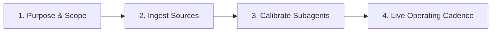
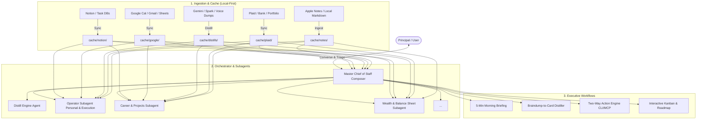

# 🏛️ AI Chief of Staff (CoS) Builder & Operating Skill

This skill provides an end-to-end blueprint, interactive setup walkthrough, and automation toolkit to build, customize, and operate an **AI Chief of Staff (CoS)** for an individual executive, founder, or power user.

---

## 🎯 How to Guide the User Through Setup (Interactive Protocol)

When a user asks to set up, build, or calibrate a Chief of Staff, walk them through the **4-Phase Setup Protocol**:



### Phase 1: Purpose & Domain Discovery
Interview the user to define their CoS archetype:
- **Operating Scope**: Personal (household, wellness, family, errands) vs. Professional (OKRs, 1-on-1s, project deliverables, career brag sheet) vs. Wealth/Assets (net worth, cashflow, real estate) vs. Venture/Sandbox.
- **Delegation Model**: Read automatically from cache; prompt user confirmation before writing cards.
- **Scaffold System**: Run `python3 .agents/skills/chief-of-staff-builder/scripts/scaffold_cos.py --domains <selected_domains> --sources <selected_sources>`.

### Phase 2: Connecting & Ingesting Data Sources
Step-by-step connection and live verification:
1. **Notion**: Configure `.env`, share databases, run `python3 notion_cli.py sync`, verify `cache/notion/board_summary.md`.
2. **Google Workspace**: Place `credentials.json`, run `python3 google_sync.py`, verify `cache/google/calendars/` and `cache/google/email/`.
3. **Financial / Plaid / Notes**: Set up API tokens or local file drops, verify normalized cache.

### Phase 3: Subagent Calibration & Testing
Verify subagent readiness before going live:
1. Run `python3 .agents/skills/chief-of-staff-builder/scripts/test_subagents.py` to audit data source coverage.
2. Run domain-specific calibration test queries (e.g. asking `operator` for daily triage, `wealth` for liquidity posture, `professional_ops` for OKR blockers).

### Phase 4: Activating Executive Operating Rhythms
Test the live operational loops:
1. **The 5-Minute Morning Briefing**: Schedule + Top 3 Must-Dos + Friction alerts.
2. **Thought-Partnering (Braindump -> Cards)**: Structure messy text into actionable task cards.
3. **Weekly Recalibration**: Cross-domain scorecard and Kanban roadmap.

For the full detailed checklist, refer to [Interactive Setup & Calibration Guide](./references/setup_guide.md).

---

## 🚀 Scaffolding & Diagnostics CLI Reference

```bash
# 1. Scaffold a full CoS setup in any directory
python3 .agents/skills/chief-of-staff-builder/scripts/scaffold_cos.py \
  --target /path/to/workspace \
  --user-name "Alex" \
  --domains operator,personal_ops,professional_ops,wealth,distill_engine \
  --sources notion,google,distills

# 2. Test subagent data cache readiness & generate calibration prompts
python3 .agents/skills/chief-of-staff-builder/scripts/test_subagents.py

# 3. Comprehensive system health check
python3 .agents/skills/chief-of-staff-builder/scripts/healthcheck.py
```

---

## 📐 The 4-Layer Architecture



---

## 📚 Deep-Dive References

- [Interactive Setup & Calibration Guide](./references/setup_guide.md): Step-by-step onboarding walkthrough, connection checks, and test prompts.
- [Architecture & Design Principles](./references/architecture.md): Local cache mechanics, MCP vs CLI, and security boundaries.
- [Ingestion Patterns & Connectors](./references/ingestion_patterns.md): Connector blueprints for Notion, Google, Apple Notes, Plaid, and Transcripts.
- [Executive Workflows & Operating Rhythms](./references/executive_workflows.md): Daily briefings, braindump distillation, weekly reviews, and GenUI boards.
