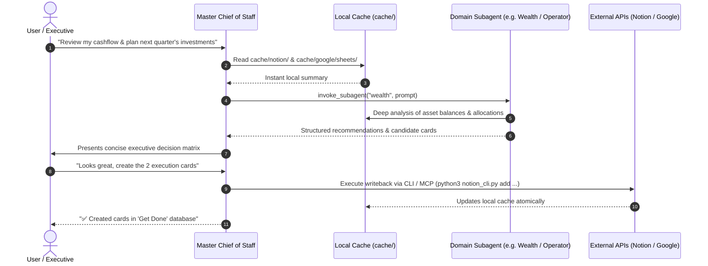

# 🏛️ AI Chief of Staff: Architectural Principles & Blueprint

This document details the system design principles, state management, security boundaries, and communication topology of an AI Chief of Staff built on Antigravity.

---

## 1. Core Architectural Pillars

### Pillar A: Local-First Ingestion & Cache
- **The Problem with Direct APIs**: Making real-time API calls to Notion, Google Calendar, Gmail, Slack, and Plaid on every chat turn causes:
  1. Massive token consumption (bloating system prompts with raw JSON payloads).
  2. High latency (blocking user turns while awaiting 4-5 network responses).
  3. API rate limits and flakiness.
- **The Local Cache Solution**:
  - Ingestion scripts sync external APIs into `cache/<source>/` as normalized JSON and pre-rendered Markdown summaries.
  - The Chief of Staff and subagents read local files instantly via native fast tools (`grep_search`, `view_file`).
  - Read queries consume zero network latency and minimal tokens.

### Pillar B: Top-Down Orchestration (Composer + Specialized Subagents)
- The **Master Composer** (`AGENTS.md`) is generalist, highly conversational, and focused on synthesis, executive triage, and user alignment.
- When deep domain knowledge or multi-step execution is required (e.g. detailed financial forecasting, deep project breakdown, complex multi-calendar reconciliation), the Composer delegates to **Domain Subagents** via `invoke_subagent`.
- Domain subagents have isolated contexts, specific data source views, and focused roles. This prevents prompt pollution and keeps conversation history clean.

### Pillar C: Separation of Personal vs. Professional Spheres
- An executive's life is split across domains with different privacy levels, urgency models, and workflows:
  - **Personal Ops**: Family commitments, medical, household tasks, personal finances, car/home maintenance, subscriptions.
  - **Professional Ops**: Company OKRs, team 1-on-1s, stakeholder deliverables, sprint backlogs, career accomplishments.
- Subagents maintain clear boundary definitions. Personal tasks are never mixed into professional project trackers, but the Master Chief of Staff can cross-reference them to prevent scheduling conflicts.

---

## 2. Directory Layout & Data Flow

```text
<workspace_root>/
├── AGENTS.md                  # Master Chief of Staff System Rules / Composer
├── .agents/
│   ├── skills/
│   │   └── chief-of-staff-builder/   # This skill & toolchain
│   └── subagents/             # Domain subagent markdown definitions
│       ├── operator.md        # Daily triage, execution, errands
│       ├── career_chronicler.md # Professional accomplishments & OKRs
│       ├── wealth.md          # Total net worth, asset allocation, cashflow
│       ├── family_legacy.md   # Family milestones, household ops
│       └── distill_engine.md  # Background chat & note synthesizer
├── cache/                     # Local-first data stores
│   ├── notion/
│   │   ├── board_summary.md   # Unified Markdown Kanban view
│   │   ├── databases/*.json   # Schemas and option tags
│   │   └── cards/*.json       # Full card JSON + Markdown bodies
│   ├── google/
│   │   ├── calendars/*.json   # Upcoming events per calendar
│   │   ├── email/             # Triaged action-required emails
│   │   └── sheets/            # Synced spreadsheet models
│   ├── distills/              # Structured extractions from chat logs
│   ├── notes/                 # Ingested Apple Notes or local MD docs
│   └── plaid/                 # Balances and cashflow aggregations
└── scripts/                   # Sync and CLI execution engines
    ├── notion_cli.py          # Two-way card & database CLI / MCP
    ├── google_sync.py         # Google Workspace sync engine
    └── sync_all.sh            # Master periodic sync runner
```

---

## 3. Communication & Execution Model



---

## 4. Progressive Disclosure & Token Budgeting

To keep context windows fast, nimble, and cost-effective:
1. **Board Summary Digest**: Instead of loading hundreds of raw Notion cards into context, generate a single `cache/notion/board_summary.md` table (~100-300 tokens) listing only active items (`Doing`, `To Do`).
2. **On-Demand Deep-Dives**: Use `grep_search` or `view_file` to fetch the specific `<card_id>.json` file only when the user discusses that specific card.
3. **Daily Agenda Extract**: Ingest upcoming 48-hour calendar events into a lightweight `cache/google/calendars/today_agenda.md` rather than maintaining month-long payloads.
